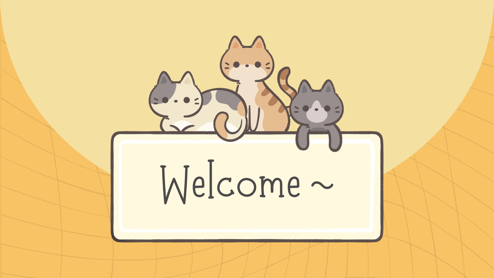

<h1 align="center">Hi there 👋, I'm Quoc-Toan Ly, you can call me Toan!</h1>

<!--

  

-->

🌱 I'm a senior Computer Science major at the University of Cincinnati, with a minor in Mathematics

⚡ I'm deeply passionate about Artificial Intelligence (AI), Machine Learning (ML), and Deep Learning (DL). The elegance of using mathematical principles to solve complex problems never ceases to captivate me 

🚀 I'm always on the lookout for new ways to leverage these technologies to tackle real-world challenges and drive innovation

🎲 Outside of tech and coding, I love sports, particularly tennis, basketball, and volleyball. I also enjoy sharpening my strategic thinking through chess

📫 How to reach me <a href="mailto:toanly0521@gmail.com" class="button">toanly0521@gmail.com</a> or <a href="mailto:lytq@mail.uc.edu" class="button">lytq@mail.uc.edu</a>

<h3 align="left">Connect with me:</h3>

<h3 align="left">Languages and Tools:</h3>
  
 
   
    
  
  
   
   
   
   
   
   
   
      
  
  
  
<!--
  <a href="https://www.postgresql.org" target="_blank" rel="noreferrer"> 
-->
  

<!--

&nbsp;

 
 

-->

<!-- activity graph heroku-app start -->

    

<!-- activity graph heroku-app end -->
